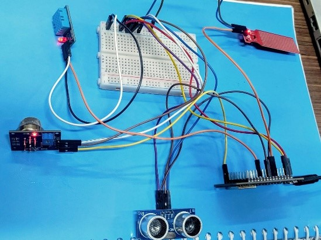
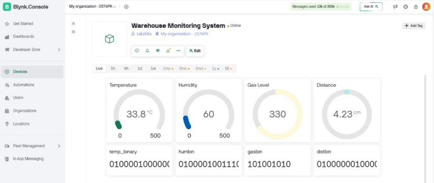
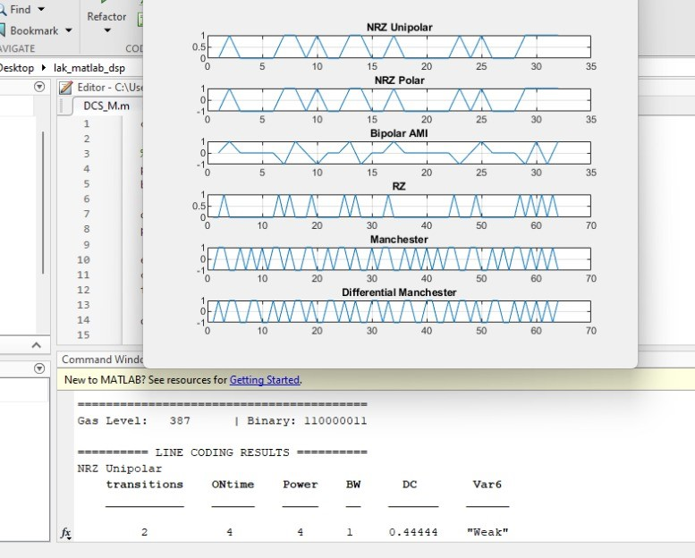
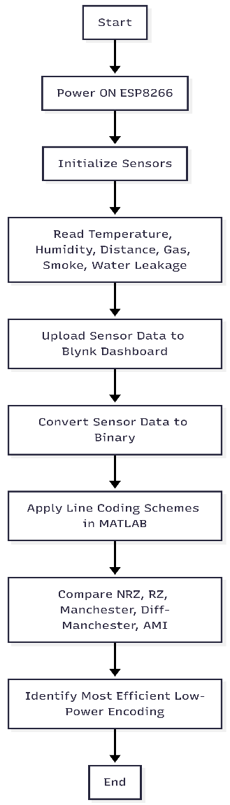

# Smart-Warehouse-Monitoring-System
IoT-based Smart Warehouse Monitoring System using ESP8266, Blynk, MATLAB and Line Coding Analysis.

# 📦 Smart Warehouse Monitoring System

An IoT-based Smart Warehouse Monitoring System designed to improve warehouse safety, environmental monitoring, and low-power communication efficiency using ESP8266, Blynk Cloud, and MATLAB-based digital line coding analysis.

This project combines real-time sensing with communication-level optimization to create an energy-efficient and scalable monitoring solution for modern warehouses and grain storage facilities.

---

# 🚀 Project Overview

Warehouses storing grains and essential materials are vulnerable to:

- Temperature rise
- Humidity variations
- Gas leakage and smoke
- Water seepage
- Pest intrusion

Traditional warehouse monitoring relies heavily on manual inspection, which is inefficient and prone to delayed hazard detection.

This project introduces an IoT-enabled monitoring system capable of:

✅ Real-time environmental sensing  
✅ Cloud-based remote monitoring  
✅ Hazard detection and alerts  
✅ Binary sensor-data transmission  
✅ MATLAB-based line coding analysis for low-power IoT communication

---

# 🎯 Objectives

- Monitor warehouse environmental conditions continuously
- Detect hazardous situations in real time
- Upload sensor data to the cloud dashboard
- Convert sensor data into binary format
- Analyze communication efficiency using digital line coding
- Identify the most power-efficient encoding technique for IoT systems

---

# 🛠 Hardware Components Used

| Component | Purpose |
|---|---|
| ESP8266 NodeMCU | Main microcontroller with Wi-Fi |
| DHT11 Sensor | Temperature & humidity monitoring |
| MQ-2 Sensor | Smoke & gas leakage detection |
| Ultrasonic Sensor | Pest/intrusion detection |
| Water Leakage Sensor | Water seepage detection |
| Breadboard & Jumper Wires | Circuit connections |

---

# 💻 Software & Technologies Used

- Arduino IDE
- MATLAB
- Blynk IoT Cloud
- ESP8266 Wi-Fi Module
- Embedded C / Arduino Programming
- Digital Communication Concepts

---

# 🔥 Key Features

- 🌡 Real-time temperature monitoring
- 💧 Humidity sensing
- 🔥 Gas and smoke detection
- 🐭 Pest/intrusion detection
- 🚨 Water leakage detection
- ☁️ Cloud dashboard monitoring
- 📡 Wireless IoT communication
- 🔢 Binary sensor-data conversion
- 📊 MATLAB waveform analysis
- ⚡ Low-power line coding evaluation

---

# 📡 System Architecture

The system works in the following stages:

1. Sensors collect environmental and safety-related data
2. ESP8266 processes sensor values
3. Sensor readings are converted into binary format
4. Data is uploaded to Blynk cloud dashboard
5. MATLAB receives binary sequences
6. Multiple line coding schemes are analyzed
7. Communication efficiency and power usage are compared

---

# 📈 Line Coding Techniques Evaluated

The project analyzes six digital line coding schemes:

- NRZ Unipolar
- NRZ Polar
- Bipolar AMI
- RZ
- Manchester
- Differential Manchester

---

# ⚡ MATLAB Analysis Parameters

The following communication parameters were evaluated:

- Signal transitions
- ON-time
- Relative power consumption
- Bandwidth usage
- DC component
- Synchronization capability

---

# 🏆 Major Result

MATLAB analysis showed that:

✅ **Bipolar AMI** provides the best overall performance for low-power IoT communication.

### Advantages of Bipolar AMI:
- Near-zero DC component
- Lower switching activity
- Reduced power consumption
- Better efficiency for battery-operated IoT systems

Compared to Manchester coding, Bipolar AMI required significantly lower switching power while maintaining reliable transmission performance.

---

# 📊 Experimental Results

The implemented system successfully achieved:

- Stable sensor monitoring
- Real-time cloud updates
- Reliable hazard detection
- Continuous Wi-Fi communication
- Accurate binary conversion
- MATLAB waveform generation and analysis

### Observed Sensor Outputs

| Parameter | Observed Range |
|---|---|
| Temperature | 28–32°C |
| Humidity | 50–65% |
| Gas Level | ~400+ during smoke testing |
| Distance Detection | 2–30 cm |

---

# 📷 Project Images

## 🔧 Hardware Setup





---

## ☁️ Blynk Dashboard





## 📊 MATLAB Output




## Flowchart


# 🎥 Project Demonstration

Watch the complete project demo here:

[▶ Smart Warehouse Monitoring System Demo](https://drive.google.com/file/d/1s1n7gkoS1ai017dZXsPL00mEbgkRVKUS/view?usp=drive_link)

The demo includes:

- ESP8266 setup
- Sensor integration
- Serial monitor outputs
- Blynk dashboard
- Binary conversion
- MATLAB simulations
- Line coding waveform analysis

---

# 📂 Repository Structure

```txt
smart-warehouse-monitoring-system
│
├── Arduino_Code
│   └── warehouse_monitoring.ino
│
├── MATLAB_Code
│   └── line_coding_analysis.m
│
├── Research_Paper
│   └── Efficient_Line_Coding_Techniques.docx
│
├── Images
│   ├── hardware_setup.jpg
│   ├── blynk_dashboard.jpg
│   ├── matlab_output.jpg
│   └── flowchart.jpg
│
└── README.md
```

---

# 📄 Research Paper

### Title

**Efficient Line Coding Techniques for Low-Power IoT-Based Warehouse Monitoring System**

The research paper included in this repository discusses:

- IoT-based warehouse safety
- Multi-sensor integration
- Cloud communication
- Binary data conversion
- Digital line coding techniques
- MATLAB communication analysis
- Energy-efficient IoT transmission

---

# 🧠 Future Improvements

Future enhancements may include:

- LoRaWAN integration
- NB-IoT communication
- Telegram or SMS alerts
- AI-based predictive analytics
- Machine learning for spoilage prediction
- Solar-powered operation
- Custom PCB development
- Industrial-grade enclosure design

---


---

# 📚 Applications

- Smart Warehouses
- Grain Storage Facilities
- Industrial Monitoring
- Cold Storage Systems
- Smart Agriculture
- IoT Safety Systems

---

# 🏷 GitHub Topics

```txt
iot
esp8266
arduino
matlab
embedded-systems
warehouse-monitoring
blynk
digital-communication
line-coding
ece-project
```

---

# ⭐ Conclusion

This project demonstrates how IoT sensing, cloud connectivity, and digital communication optimization can be combined to create an efficient and scalable warehouse monitoring solution.

By integrating real-time hazard detection with energy-aware line coding analysis, the system improves warehouse safety while reducing communication power consumption for long-term IoT deployment.

---
